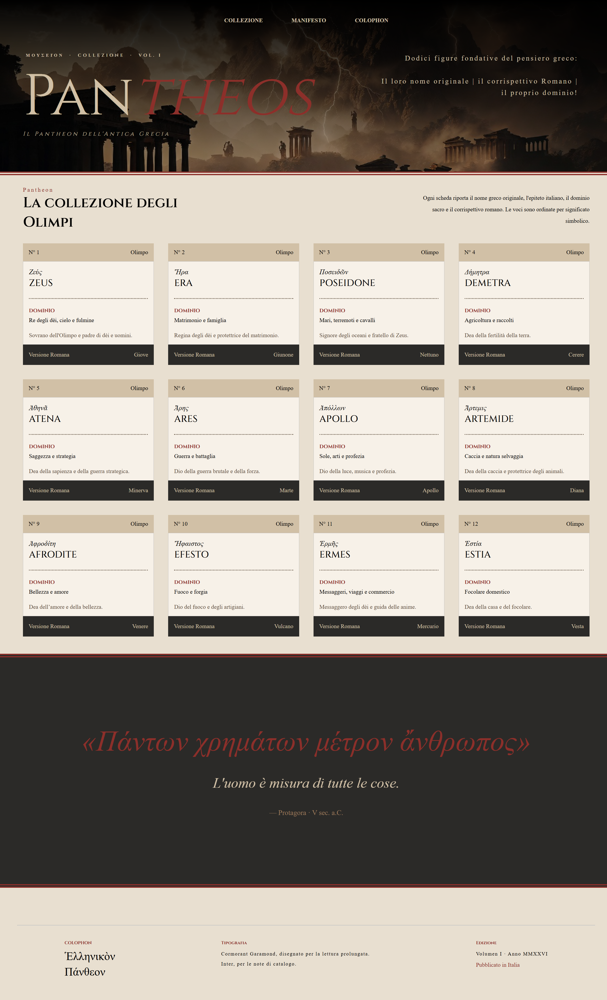
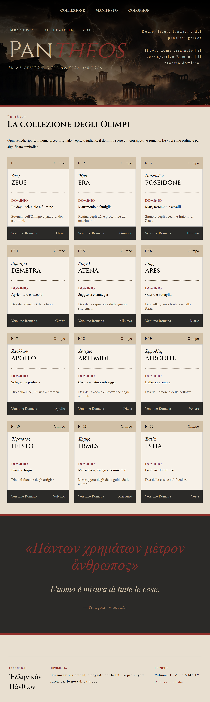
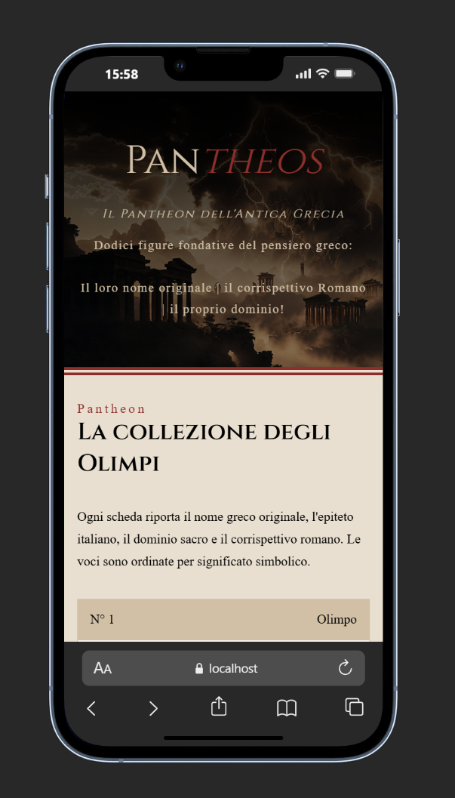

<h1 align="center">Progetto-2-TypeScript-Mythos-Grecia</h1>

###

  
  
  
  
  
  
  

###

###

<h2 align="left"></h2>

###

<h2 align="center">Progetto 2: TypeScript</h2>

###

<h3 align="left">Il progetto:</h3>

###

Progetto frontend focalizzato esclusivamente sull'aspetto estetico, realizzato come obiettivo finale del corso di TypeScript della durata di 8 ore.  Il progetto pone particolare attenzione all'organizzazione della struttura, alla realizzazione di un layout responsive e all'applicazione delle best practice per scrivere codice pulito e manutenibile con TypeScrypt

###

<h3 align="left">Obiettivi:</h3>

###

- L'obiettivo principale di questo progetto è lo sviluppo di un'applicazione robusta e scalabile in TypeScript.  - Ottimizzare l'organizzazione del codice e la pulizia del progetto. - Ripassare React e Css Vanilla

###

<h3 align="left">Passaggi svolti:</h3>

###

- Inizializzazione del progetto in React/TypeScript, utilizzando Vite come Build - Sistemazione dei file "config" per avere un ambiente di lavoro performante - Ricerca del font, generazione delle immagini con le Ia e ricerca di palette di colori adeguata - Creazione della macrostruttura del progetto. - Realizzazione pagina completa solo stile visivo - Realizzazione di un file data contenente tutti i principali dei Greci, ottimizzati usando TypeScript e cercando d'integrare le nozioni imparate. - Creazione della parte Responsive per tablet e smartphone

###

